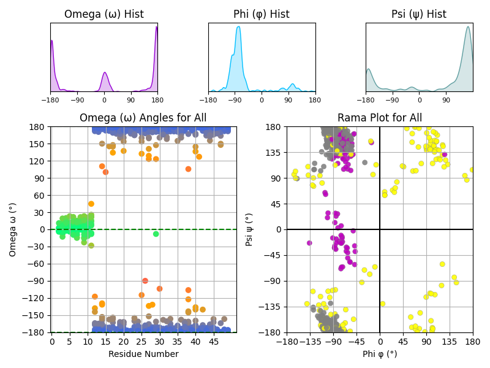

# PyMOL Protein & Peptoid Torsion Angle Plotting Scripts

## Overview

This repository contains scripts for analyzing and plotting torsion angles (omega (ω), phi (φ), psi (ψ)) for proteins and peptoids using PyMOL. The scripts allow for flexible selection of molecules and can generate various torsion angle plots.



## Author

**Allon Goldberg**  
Research Assistant, Flatiron Institute (NYC)  
Center for Computational Biology, Biomolecular Design Group  
Date: 2/25/2025

## Installation

If the required dependencies are not installed in your PyMOL environment, install them using:

```python
pip install matplotlib seaborn scipy numpy
```

## Usage

Run the script from the PyMOL terminal:

```python
run <path_to_script>/plot_omega_pymol.py
```

Once the script is loaded, you can use the available commands to retrieve and visualize torsion angles.

## Commands

| Command                | Description |
|------------------------|-------------|
| `help(<function_name>)` | Print detailed information about a specific function. |
| `plot_omega_info`       | Display general information about the script's functions. |
| `get_omega_angles SELECTION_STRING, PRINT_BOOL` | Retrieve the omega angles for a given selection and optionally print values to the terminal. |
| `get_phipsi_angles SELECTION_STRING, PRINT_BOOL` | Retrieve the phi/psi angles for a given selection and optionally print values to the terminal. |
| `plot_omega SELECTION_STRING, PRINT_BOOL` | Plot the omega angles for a given selection and optionally print values to the terminal. |
| `plot_rama SELECTION_STRING, PRINT_BOOL` | Generate a Ramachandran plot (psi vs. phi angles) for a given selection and optionally print values to the terminal. |
| `plot_all_angles SELECTION_STRING, PRINT_BOOL` | Plot all torsion angles (omega, phi, psi) for a given selection and optionally print values to the terminal. |

## Example Usage

```python
plot_omega_info  
get_omega_angles all, True  
plot_omega chain A, False  
plot_rama resi 10-50, True  
plot_all_angles selection_name, False  
```

